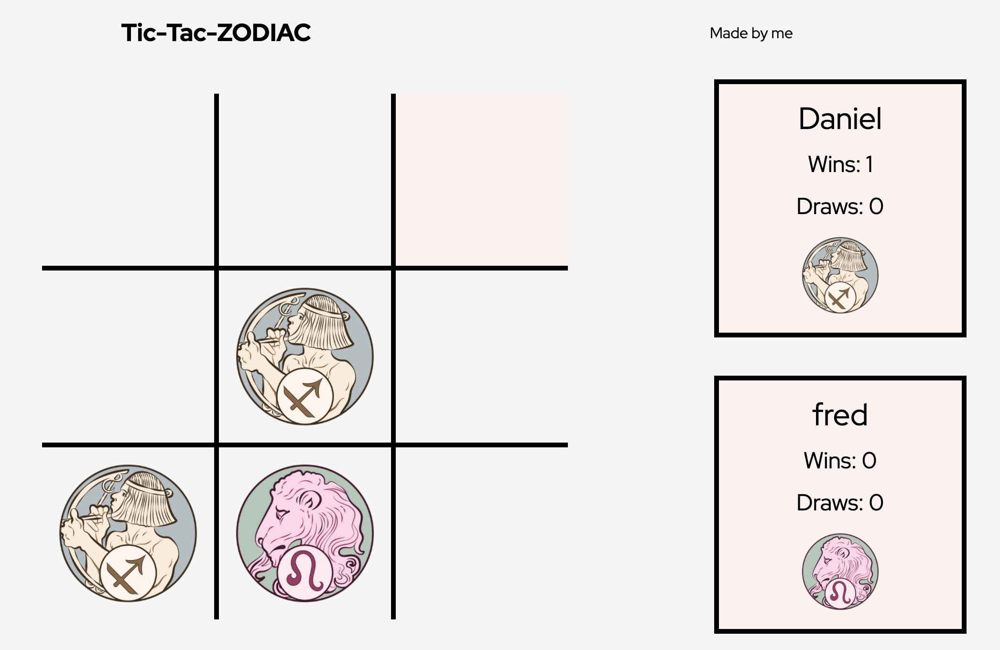

# **Tic-Ta-Zodiac Readme**

> ### "I don't believe in astrology; I'm a Sagittarius and we're skeptical." - Arthur C. Clarke

## **How to Play**

You can find and play the Tic-Tac-Zodiac game [here](https://thelorddoyle.github.io/tic-tac-toe/).

## _**Project 0**_

I began a 3-month intense Software Engineering Bootcamp at General Assembly in December 2020. In week 3 we are given Project 0 (because JavaScript arrays initiate at 0).

### **Big Goals**
- Build a web application from scratch, without a starter codebase
- Use your programming skills to map out the game logic for a simple game like Tic Tac Toe
- Separate HTML, CSS, and JavaScript files in your application
- Build an application to a spec that someone else gives you
- Build a dynamic game that allows two players to compete
- Write a README.md file that explains your app to the world

### **Technical Requirements**

Your app must:

- Render a game board in the browser
- Switch turns between X and O (or whichever markers you select); your game should prevent users from playing a turn into a square that is already occupied
- Visually display which side won if a player gets three in a row; or show a draw/"cat’s game" if neither wins
- Include separate HTML / CSS / JavaScript files
- Stick with KISS (Keep It Simple Stupid) and DRY (Don't Repeat Yourself) principles
- Use Javascript with jQuery (or vanilla DOM methods if you really prefer) for DOM manipulation
- Deploy your game online, where the rest of the world can access it
- Use semantic markup for HTML and CSS (adhere to best practices)

## **Tic-Tac-Zodiac**

### **Aims**

**1.** I wanted people to _actually_ want to play and share my game. I had shareability at the top of my list.

**2.** I wanted to focus on a 2-human-player game that could be played multiplayer over the network.

**3.** I wanted it to be fun and relatable for many people.

### **The Game & Main Features**

I use star signs and 'compatibility' as the means for shareability and try to make the web app attractive and easy to use.

The game takes 2 human player's names and birth dates, assigns them a logo based on their star sign. They then play a set of 3 games of Tic-Tac-Toe and are then given two sets of results:

1. Actual astrological results

2. A result based on how many games were won / drawn / lost

And I am working on making it able to be played over the network but have not yet finished this.

### **Screenshots**

### _**Gameplay**_

### _**Example Astrology Results**_

### _**Example Gameplay Result**_

## **Known Bugs**

There are no known bugs, but there are features that are yet to be introduced. See WishList.

## **Tech Used**

The program uses HTML, CSS, JavaScript and the jQuery library.

## **WishList**

### Overall

- Add mutliplayer functionality
- Add in LocalStorage

### Character Creation

- Collect more information so it can build funnier responses at the end e.g. hobbies, favourite color (could change game board piece hover)

### Results

- Add sharing buttons when results are given so that users can send to others to play together
- Actually have the astrological score and the zodiac score combine and provide a more intelligent response
